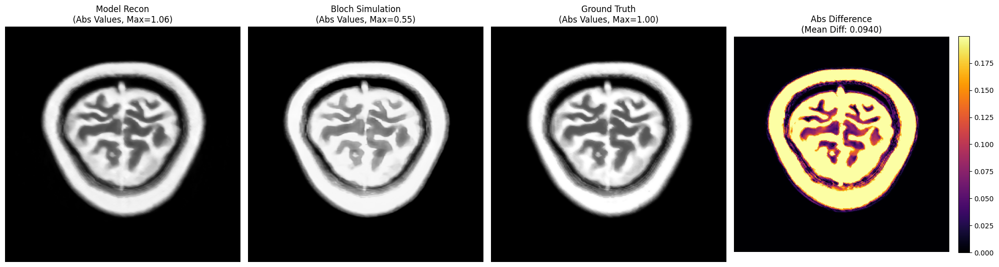
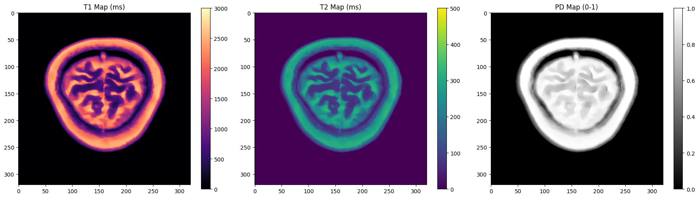
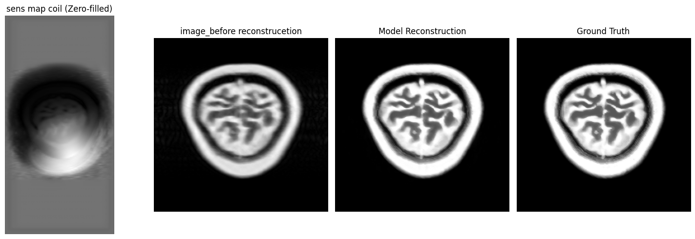
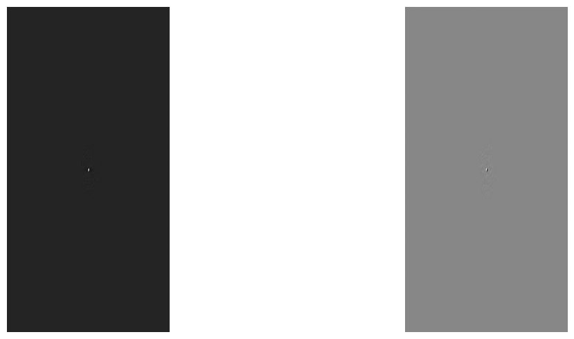

# PhysicalVarNet: Physics-Driven Variational Networks for Quantitative MRI



PhysicalVarNet is a sophisticated deep learning framework designed for high-fidelity MRI reconstruction and simultaneous quantitative parameter mapping. Unlike standard reconstruction networks, PhysicalVarNet integrates MR physics priors to jointly estimate clinical images and underlying physical parameters directly from subsampled k-space data.

## 🌟 Advanced Features

*   **Joint Reconstruction & Mapping**: Simultaneously reconstructs MR images and generates high-resolution **T1, T2, and PD maps**.
*   **Physics Parameter Extraction**: Automatically extracts critical MR acquisition parameters including **TR (Repetition Time)**, **TE (Echo Time)**, and **FA (Flip Angle)** from the data.
*   **Physics-Driven Architecture**: Leverages Variational Networks (VarNet) constrained by the physical Bloch equations to ensure biological and physical consistency.
*   **fastMRI Integration**: Built on the foundations of the Facebook AI Research `fastMRI` project with custom physical layer enhancements.
*   **Environment Agnostic**: Robust configuration management via `configs/config.yaml` for seamless portability across different compute environments.

## 📁 Repository Structure

```text
PhysicalVarnet_git/
├── assets/          # Extracted clinical maps, reconstruction plots, and diagrams
├── configs/         # Centralized configuration (YAML)
├── data/            # Data directory (Raw k-space data)
├── notebooks/       # Interactive pipelines for training, validation, and visualization
├── src/             # Core implementation (Model architecture, Physics layers, Utils)
└── requirements.txt # Dependency manifest
```

## 🛠️ Getting Started

### Installation
1.  Clone the repository:
    ```bash
    git clone https://github.com/your-username/PhysicalVarnet.git
    cd PhysicalVarnet
    ```
2.  Install required packages:
    ```bash
    pip install -r requirements.txt
    ```

### Configuration
Update the `configs/config.yaml` to point to your local data paths:
```yaml
paths:
  train_path: "./data/train/"
  val_path: "./data/val/"
  default_checkpoint: "models/checkpoint_best.pth"
```

## 🧪 Operational Workflow

### Quantitative Mapping Pipeline
PhysicalVarNet unravels the physical components of the tissue by solving the inverse problem of MRI.
1.  **Input**: Subsampled k-space data + acquisition metadata.
2.  **Network**: Physics-constrained unrolled optimization.
3.  **Outputs**: 
    *   **Reconstructed Image**: Before, After, and Ground Truth comparison.
    *   **Quantitative Maps**: High-resolution T1, T2, and PD maps.
    *   **Acquisition Parameters**: Extracted TR, TE, and FA.

### Running Inference
```bash
python src/main.py
```

## 📊 Visual Results

Below are representative outputs from the PhysicalVarNet pipeline.

### 1. Bloch Reconstruction & Parameter Extraction
Estimates acquisition parameters (TR, TE, FA) while reconstructing the physical signal.


### 2. Quantitative Relaxation Maps
High-fidelity mapping of T1, T2, and Proton Density (PD).


### 3. Reconstruction Performance
Comparison between zero-filled input, PhysicalVarNet reconstruction, and the ground truth.


### 4. K-Space Visualization
Visualization of the raw and masked k-space data processed by the model.


## 📜 Academic Context & Acknowledgements

PhysicalVarNet extends the principles of Variational Networks by incorporating explicit signal models for quantitative imaging. This project builds upon the open-source `fastMRI` codebase.

---
*For research and educational purposes. Developed as part of advanced MRI reconstruction studies.*
